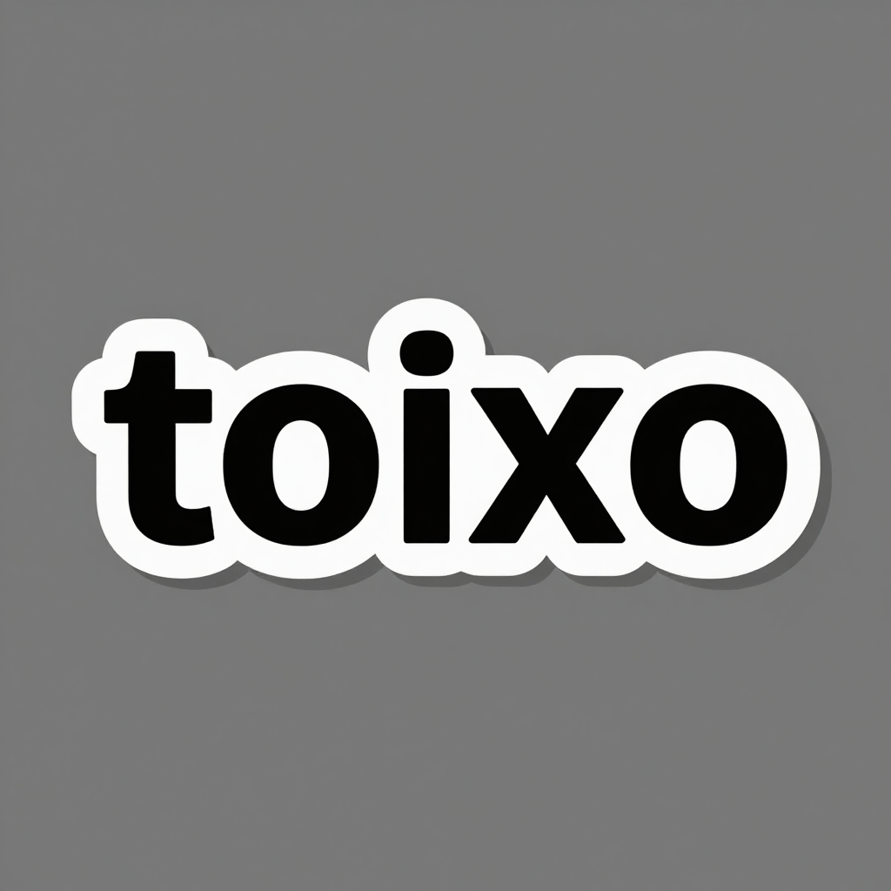
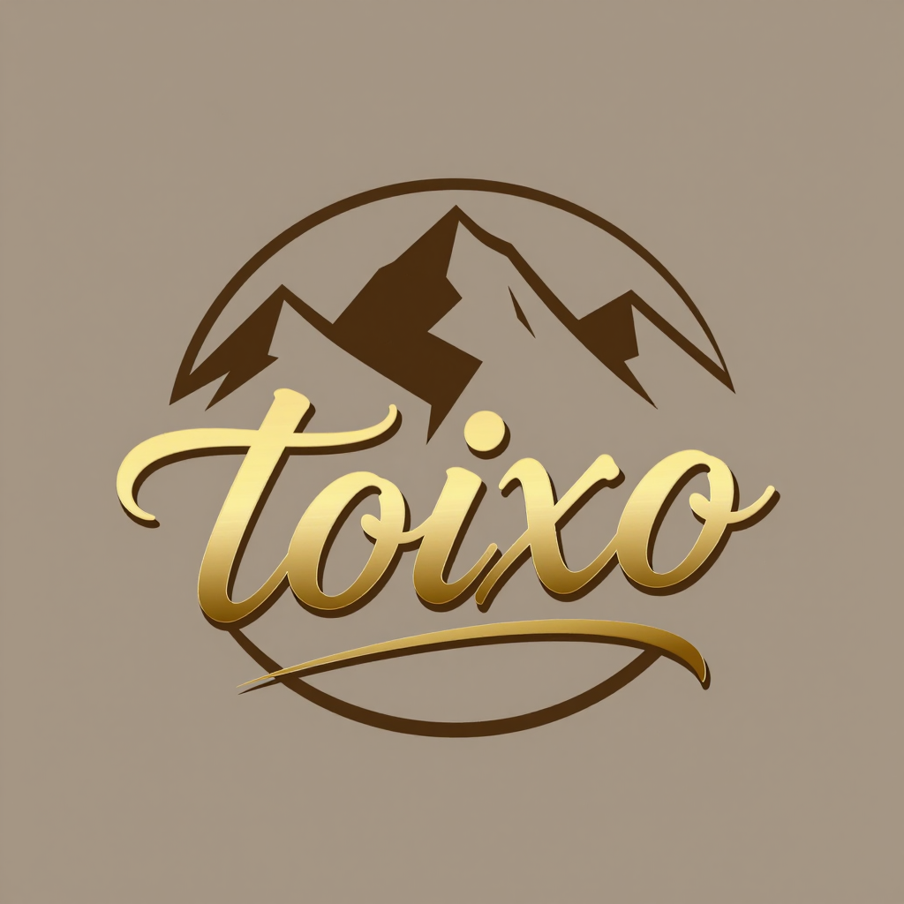
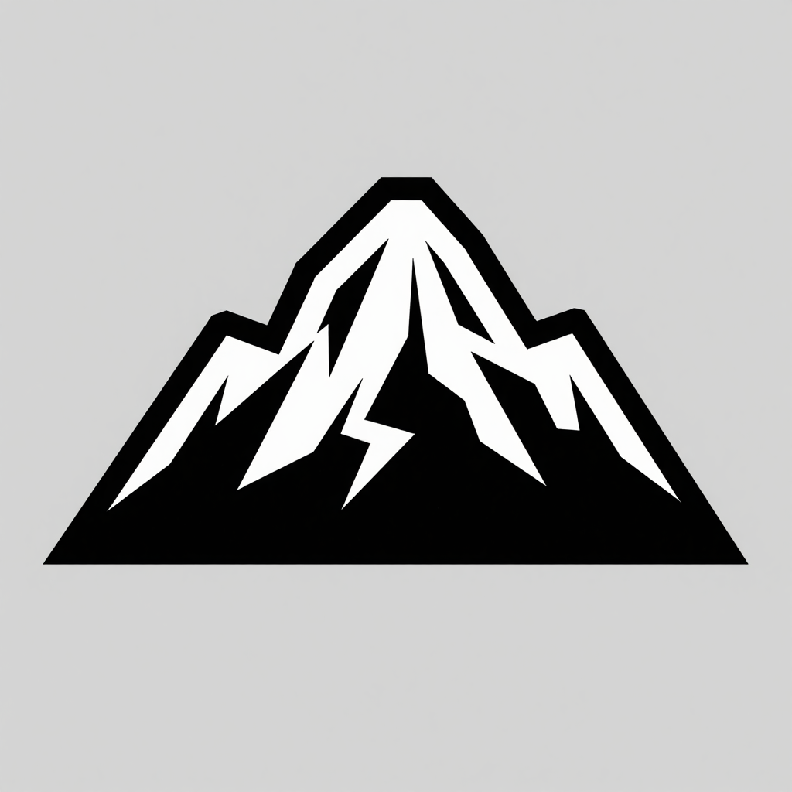
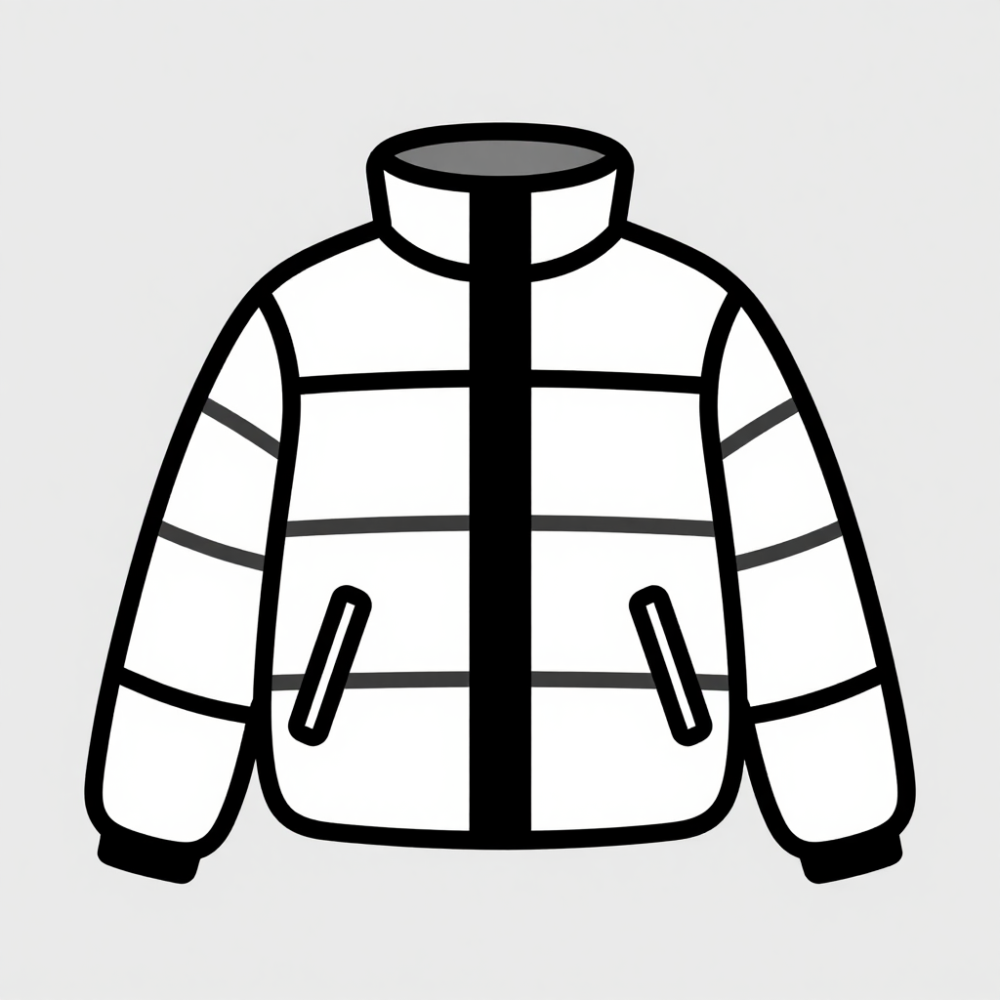
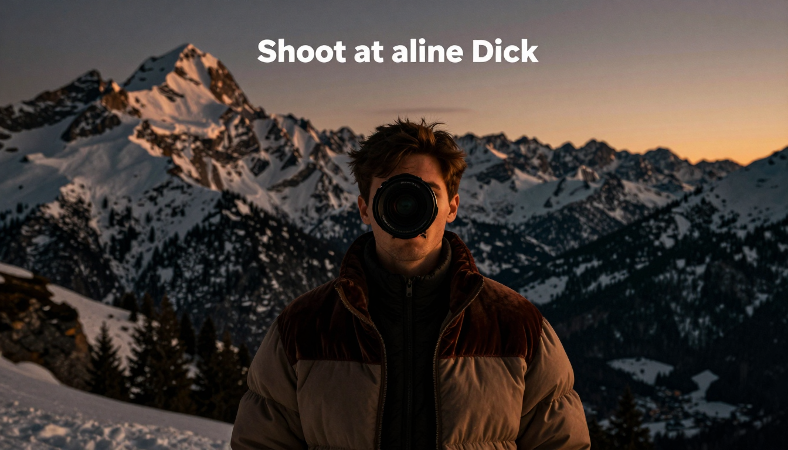
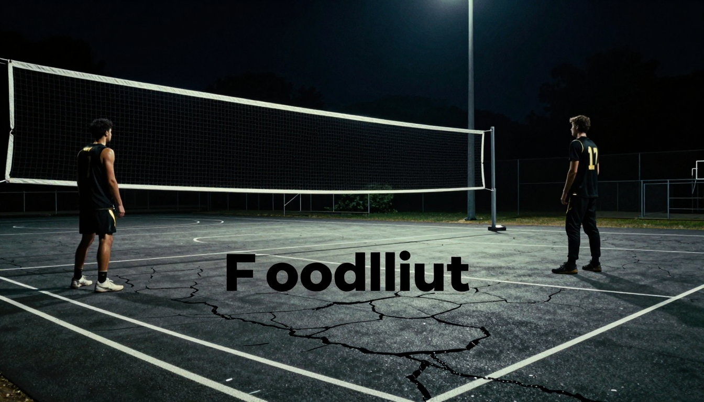
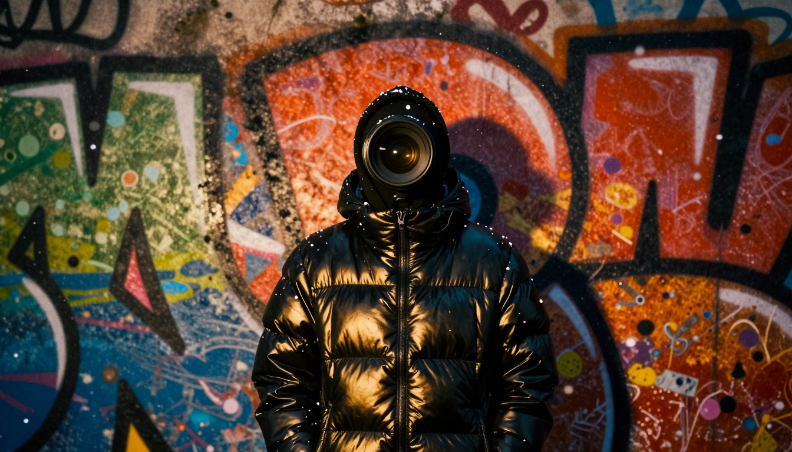
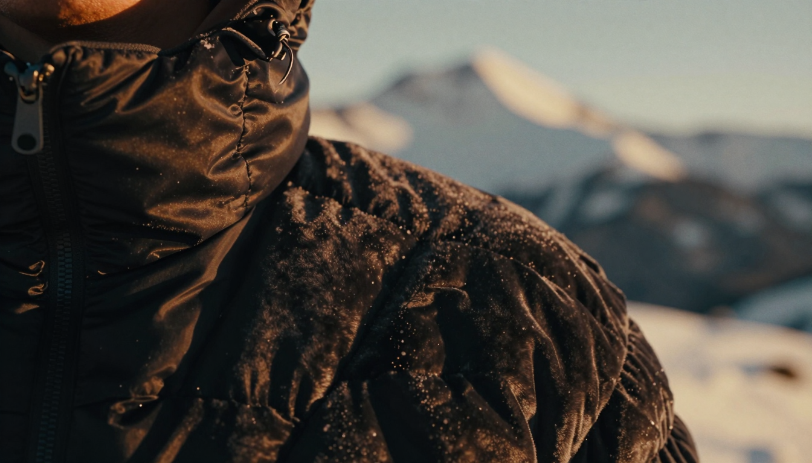
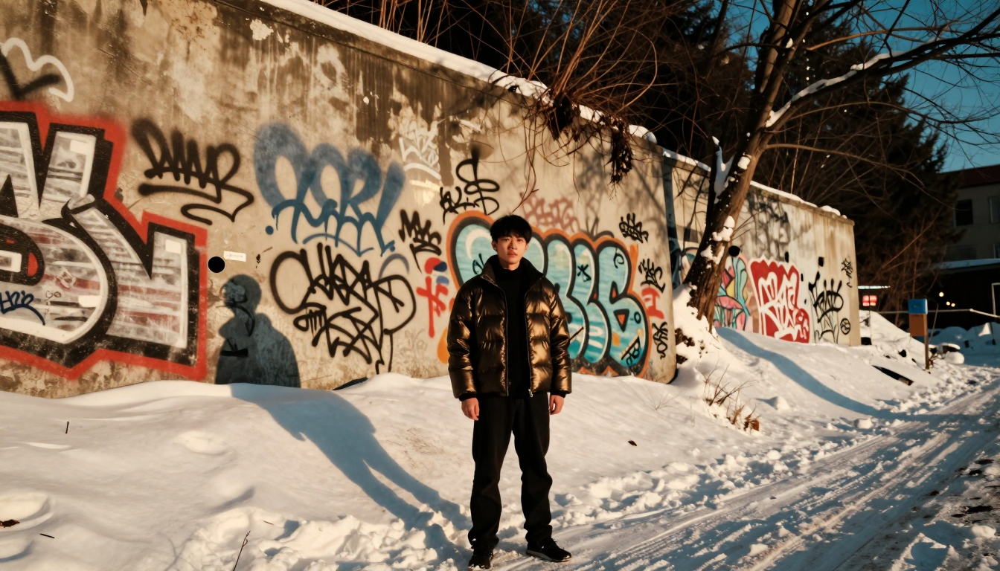
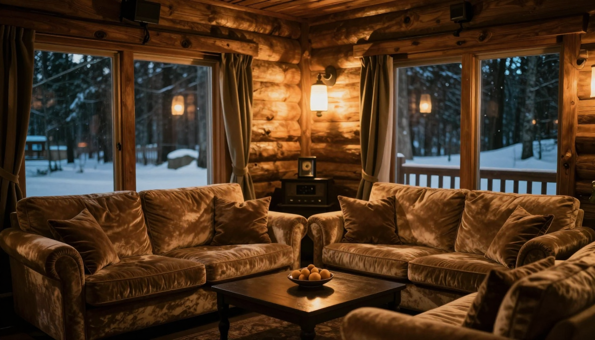

# toxico — centcom brand review + logo concepts (2026-08-08)

Generated by llama3.3:70b (review + prompts) and ComfyUI (renders) on centcom.

## Brand read

toxico is a streetwear brand offering elevated loungewear for the sporting life, with a focus on apres-ski and court-inspired apparel. The site features graffiti-wall backdrops, dark pages, and instant product drops.

## Concepts

### 1. toxico mark

Simple, bold typography to match the brand's streetwear energy

*Prompt:* Vector logo: 'toxico' in custom, sans-serif font, bold lines, black and white color scheme on plain background

### 2. ski slope icon

Incorporating apres-ski elements to reflect the brand's sporting life angle

*Prompt:* Vector logo: stylized ski slope symbol integrated with 'toxico' text in a modern, geometric font, icy blue and white colors on plain background

### 3. hoop fusion

Merging court and street elements for a unique visual identity

*Prompt:* Vector logo: abstract basketball hoop merged with 'toxico' typography, graffiti-inspired patterns, dark grey and neon green colors on plain background

### 4. mountain crest

Elevating the brand with a premium, mountain-inspired emblem

*Prompt:* Vector logo: stylized mountain range forming a crest around 'toxico' text in elegant, cursive font, earthy tones and metallic gold accents on plain background

## Icon-only round (2026-08-08) — no lettering

### Icon 1. toxico peak

representing the apres-ski lifestyle with a stylized mountain icon

*Prompt:* a stylized vector mountain symbol with bold lines and geometric shapes on a plain background, inspired by graffiti and streetwear, no text, no letters, no numbers, no words, no typography

### Icon 2. hoop flame

combining basketball and streetwear elements with a fiery twist

*Prompt:* a flat vector-style symbol of a basketball hoop merged with a flame, using bold lines and vibrant colors on a plain background, inspired by urban graffiti, no text, no letters, no numbers, no words, no typography

### Icon 3. puff crest

embodying the elevated loungewear spirit with a stylized puffer jacket icon

*Prompt:* a simplified vector representation of a puffer jacket as a crest or shield, using geometric shapes and bold lines on a plain background, inspired by streetwear and apres-ski aesthetics, no text, no letters, no numbers, no words, no typography

### Icon 4. court crown

symbolizing the intersection of sport and luxury with a regal icon

*Prompt:* a stylized vector crown symbol incorporating elements of basketball courts and streetwear, using bold lines and geometric shapes on a plain background, inspired by urban culture and elevated loungewear, no text, no letters, no numbers, no words, no typography

## Hero round (2026-08-08) — full-latitude brand imagery

### Hero 1. dusk descent

Captures the serene atmosphere of apres-ski with a hint of luxury texture

*Prompt:* album cover art, Shoot at alpine dusk, 24mm lens, warm light, snow-covered peaks, puffer jacket in velvet trim, moody colors, deep shadows, cinematic photography, film grain, rich color, no text, no lettering

### Hero 2. court nocturne

Evokes the gritty yet luxurious feel of a nighttime basketball court

*Prompt:* album cover art, Floodlit court at night, 50mm lens, high contrast, chain nets, cracked asphalt, gold accents on black clothing, dramatic lighting, dark blues and greys, cinematic photography, film grain, rich color, no text, no lettering

### Hero 3. graffiti snow

Combines urban grit with winter wonderland, reflecting toxico's eclectic style

*Prompt:* album cover art, Sodium-lit graffiti wall at dusk, 35mm lens, snowflakes falling, vibrant colors, black puffer jacket with gold quilting, mix of rough and luxurious textures, cinematic photography, film grain, rich color, no text, no lettering

### Hero 4. quilted peak

Abstract close-up highlighting luxury texture against a winter backdrop

*Prompt:* album cover art, Macro shot of puffer jacket's velvet quilting, 100mm lens, snow-capped mountain blurred in background, warm golden light, deep blacks, inviting textures, cinematic photography, film grain, rich color, no text, no lettering

### Hero 5. street slope

Blends the dynamism of the street with the tranquility of the slopes

*Prompt:* album cover art, Graffiti-tagged wall meets snow-covered slope, 28mm lens, late afternoon sun, mix of sodium and natural light, black and gold clothing, urban and natural textures combined, cinematic photography, film grain, rich color, no text, no lettering

### Hero 6. lodge lights

Conveys coziness and luxury in the midst of an active, sporting lifestyle

*Prompt:* album cover art, Warm lodge interior at night, 40mm lens, soft focus on lodge lights, dark wood accents, plush velvet couches, golden lighting, snow outside visible through windows, inviting atmosphere, cinematic photography, film grain, rich color, no text, no lettering
