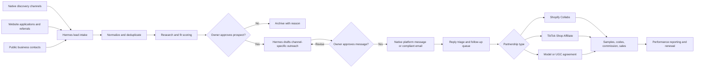

# Creator Recruiting and Affiliate Architecture

**Brand:** iamtoxico  
**Status:** Proposed  
**Last reviewed:** 2026-08-09

## Purpose

Build a repeatable, human-supervised system for recruiting models, content creators, and influencers through samples, discounts, paid work, and affiliate commissions.

The proposed division of responsibility is:

- **Shopify Collabs:** creator onboarding, gifts, discount codes, affiliate attribution, commissions, and payouts.
- **TikTok Shop Affiliate Center:** TikTok-native discovery, target collaborations, samples, shoppable content, and TikTok-attributed commissions.
- **Meta Creator Marketplace:** Instagram-native creator discovery, partnership outreach, creator insights, branded content, and partnership-ad permissions.
- **Model Mayhem:** manual talent discovery and formal casting calls for modeling and content-production work.
- **Hermes:** research, qualification, deduplication, drafting, approval queues, compliant email delivery, reply triage, reminders, and reporting.
- **Human owner:** offer approval, final outreach approval, negotiations, sensitive replies, model releases, content approval, and relationship management.

## Recommended Program Design

Use distinct programs because modeling, content licensing, and affiliate promotion are not the same job.

| Program | Primary exchange | Suggested starting offer | Required agreement |
|---|---|---|---|
| Product seeding | Product sent with no guaranteed post | One selected sample; optional affiliate offer | Gift disclosure instructions |
| Affiliate creator | Performance-based promotion | 15% audience discount and 10–15% commission | Affiliate terms and disclosure instructions |
| Ambassador | Recurring brand relationship | Periodic samples, 15–20% commission, early access | Ambassador terms and content guidelines |
| UGC creator | Content made for iamtoxico channels | Product plus a fixed content fee | Deliverables and content usage license |
| Model | Appearance in a defined shoot | Paid rate, product, or clearly agreed trade | Model release, usage, territory, media, and term |
| Hybrid creator-model | Appearance plus promotion | Fee/product plus affiliate commission | Model release, content license, affiliate terms, disclosures |

Do not describe a product-only offer as a paid modeling job. State compensation, deliverables, content rights, location, and whether posting is optional or required before the person accepts.

## Channel Assessment

### Shopify Collabs

**Best use:** the central affiliate and gifting system after a prospect has been selected.

Shopify Collabs supports direct invitations, application pages, free-product gifts, percentage or fixed discounts, affiliate links/codes, sales tracking, commissions, and payouts. It is available on Shopify plans other than Starter and Retail. Shopify currently says general new creator signup is paused, but merchants can still send direct invitations and accept creator applications.

**Hermes role:**

- prepare approved creator records for invitation;
- draft the invitation copy;
- reconcile Collabs status and performance into the lead ledger;
- flag unclaimed gifts, inactive affiliates, and high performers;
- never create or change commission terms without owner approval.

**Implementation level:** native first. Add custom API work only after manual program operations prove the need.

Sources: [Shopify Collabs for merchants](https://help.shopify.com/en/manual/promoting-marketing/collabs/merchants), [Collabs programs](https://help.shopify.com/en/manual/promoting-marketing/collabs/merchants/collabs-programs), and [creator connections](https://help.shopify.com/en/manual/promoting-marketing/collabs/merchants/creator-connections).

### Instagram

**Best use:** fashion creators, stylists, photographers, local models, UGC creators, and visual brand partnerships.

Use Instagram Creator Marketplace in Meta Business Suite where available. It supports creator search, lists, insights, campaigns, partnership messages, branded content, and partnership ads. It uses authenticated first-party Meta data and is safer and more useful than building a scraper.

**Discovery avenues:**

- Creator Marketplace filters and recommendations;
- followers and engaged commenters on the iamtoxico account;
- relevant local photographers, stylists, venues, and fashion-event accounts;
- creator applications linked from the iamtoxico bio;
- manual exploration of niche, aesthetic, and location terms;
- referrals from creators already working with the brand.

**Hermes role:**

- generate search briefs and keyword/location combinations;
- accept manually exported or entered candidates;
- research public portfolio and business-contact information;
- score fit and draft individualized partnership messages;
- prepare a daily review queue;
- track replies and move accepted prospects into Shopify Collabs.

**Automation boundary:** do not use browser bots to harvest profiles or mass-send DMs. Hermes should prepare copy and records; the owner should send through Creator Marketplace or Instagram unless an officially supported, reviewed integration explicitly permits the action.

Meta requires paid partnerships to be disclosed with its paid-partnership label. See [Instagram Creator Marketplace](https://www.facebook.com/help/instagram/337707278243327/) and [Meta creator marketing](https://www.facebook.com/business/ads/creator-marketplace).

### TikTok and TikTok Shop

**Best use:** short-form product demonstrations, styling videos, try-ons, live shopping, affiliate sales, and creator-led UGC.

TikTok Shop Affiliate supports:

- **Open collaboration:** eligible creators can discover products;
- **Target collaboration:** iamtoxico selects specific creators;
- commission tracking and automatic commission payment;
- free or refundable samples;
- collab invitations and creator performance reporting;
- affiliate videos and LIVE shopping.

TikTok's seller tools should be the primary TikTok discovery and contact layer. Its general developer API is designed around authorized users and content posting; it should not be treated as a general-purpose creator-search or cold-DM API.

**Hermes role:**

- define target-creator filters and campaign briefs;
- rank exported candidates using brand-fit criteria;
- draft Target Collaboration messages;
- track sample approval, shipment, content deadlines, content URLs, GMV, and commission;
- identify creators to renew, upgrade, or stop seeding;
- prepare content for the iamtoxico account, with human review before posting.

**Automation boundary:** conduct invites and sample management through TikTok Shop Seller Center. Do not scrape TikTok or automate cold DMs. If content-posting integration is added later, use TikTok's audited Content Posting API and preserve the account owner's consent and posting controls.

Sources: [TikTok Shop Affiliate](https://business.tiktokshop.com/us/affiliate), [sample management](https://seller-us.tiktok.com/university/essay?identity=1&knowledge_id=5694209038927617&shop_region=US), and [TikTok Content Posting API](https://developers.tiktok.com/products/content-posting-api).

### Model Mayhem

**Best use:** models, photographers, wardrobe stylists, makeup artists, and defined local shoots—not broad affiliate recruitment.

Create a legitimate **Talent Recruiter** profile for iamtoxico and post casting calls containing:

- shoot concept and brand description;
- city, date range, duration, and location type;
- age requirement of 18+;
- sizes or fit requirements only when genuinely necessary;
- exact compensation: paid, product, trade-for-images, or a combination;
- deliverables and intended content usage;
- whether social posting or affiliate participation is optional;
- a link to a credible iamtoxico site and contact channel.

Hermes can draft casting calls, create evaluation rubrics, prepare response templates, and organize applicants. Candidate discovery and messaging must remain within Model Mayhem's intended interface.

**Automation boundary:** Model Mayhem's terms prohibit using robots, spiders, scrapers, or other automated means to access, monitor, or copy its content without written permission. It also directs brands and recruiters to use Talent Recruiter profiles and casting calls. Hermes must not scrape the platform or operate an account bot.

Sources: [Model Mayhem casting search](https://www.modelmayhem.com/casting/search_casting), [Talent Recruiter requirements](https://www.modelmayhem.com/education/membership-requirements), and [supplemental terms](https://www.modelmayhem.com/supplemental-terms).

### Additional Lead Sources

| Source | Good for | Hermes-safe workflow |
|---|---|---|
| Shopify Collabs application page | Inbound affiliates and existing fans | Qualify applications and prepare accept/reject queue |
| iamtoxico website application form | Models, UGC creators, ambassadors | Ingest consented submissions directly into CRM |
| Existing customers | Authentic micro-creators and ambassadors | Invite customers who opt in; do not infer sensitive traits |
| Local photographers and stylists | Referral networks and shoot teams | Research public business contacts and draft personal email |
| Fashion schools and colleges | Student creators and campus ambassadors | Contact official clubs/programs or publish an open application |
| Pop-ups, markets, nightlife, and art events | Local talent and community creators | Build event lists and follow up only with collected consent |
| Creator referrals | High-trust recruitment | Give active creators a referral form or code |
| Agencies and creator managers | Larger creators and contracted talent | Research official agency contacts and draft business outreach |
| Backstage/Casting Networks or similar services | Formal paid casting | Use platform-native postings and applicant workflows |
| Pinterest, YouTube, Twitch, newsletters, and blogs | Longer-lived niche influence | Manual discovery plus public business-email outreach |

## Lead Qualification Model

Audience size is not the primary score. A small creator with a strong visual fit and credible engagement may be more valuable than a large generic account.

Score each candidate from 0–5 on:

| Criterion | Weight | Meaning |
|---|---:|---|
| Brand/aesthetic fit | 25% | Does their style naturally suit iamtoxico? |
| Content quality | 20% | Composition, lighting, editing, voice, and consistency |
| Audience relevance | 15% | Fashion, streetwear, loungewear, art, nightlife, or adjacent interests |
| Engagement quality | 15% | Real discussion and repeat community participation, not vanity counts |
| Reliability evidence | 10% | Consistent posting, previous collaborations, professional contact process |
| Geography/logistics | 5% | Useful for shoots, shipping, events, and target markets |
| Commercial readiness | 5% | Business contact, creator marketplace presence, or affiliate experience |
| Brand safety | 5% | No obvious fraud, impersonation, purchased engagement, or incompatible conduct |

Use the score to prioritize human review, never as an automatic rejection for protected characteristics. Do not collect race, religion, health, sexuality, or other sensitive data unless there is a lawful, necessary, and explicitly approved reason.

## General Architecture



## Technical Stack

### Phase 1: low-complexity pilot

Use the infrastructure already available before building a custom application.

- **Agent/orchestration:** the local Hermes installation.
- **Lead ledger:** SQLite as the canonical store; CSV export for owner review.
- **Attachments:** local `data/creator-recruiting/` directory for approved briefs and exports; never store downloaded profile media without a legitimate need.
- **Scheduling:** Hermes cron for research reminders, follow-up queues, and weekly reports.
- **Email:** Hermes SMTP sender from a branded iamtoxico address, not a personal Gmail identity.
- **Commerce:** Shopify, Shopify Collabs, Shopify Flow where supported, and Printify.
- **TikTok:** TikTok Shop Seller Center and Affiliate Center.
- **Instagram:** Meta Business Suite and Creator Marketplace.
- **Model recruiting:** Model Mayhem Talent Recruiter account and native casting tools.
- **Agreements:** a template/e-sign service for model releases, UGC licenses, and paid deliverables.
- **Secrets:** existing Hermes environment/secret handling; never place credentials in the lead database or repository.

No vector database, large CRM, or custom web application is needed for the first 100–250 prospects.

### Phase 2: operational dashboard

Add this only after the pilot reveals real workflow friction:

- **API:** Python with FastAPI.
- **Database:** PostgreSQL if multiple processes or users need concurrent access; otherwise keep SQLite.
- **Admin UI:** a small server-rendered interface or lightweight React/Next.js dashboard.
- **Job queue:** Hermes cron first; add Redis plus a worker only for reliable webhook or batch-processing needs.
- **Integrations:** Shopify Admin API/webhooks, Shopify Flow, email provider webhooks, and approved platform APIs.
- **Analytics:** Shopify reports plus a small warehouse table or Metabase dashboard when volume warrants it.

Avoid building a general social scraper, automated DM bot, or parallel affiliate ledger that competes with Shopify/TikTok attribution.

## Canonical Data Model

Minimum entities:

```text
lead
  id, display_name, stage, owner, created_at, updated_at
  city, region, country, source, source_profile_url
  public_business_email, contact_permission_basis
  audience_summary, brand_fit_score, risk_flags
  notes, next_action_at, do_not_contact_at

channel_identity
  lead_id, platform, handle, profile_url
  follower_band, engagement_notes, last_verified_at

campaign
  id, name, objective, partnership_type
  product_ids, geography, offer_version, start_at, end_at

offer
  id, lead_id, campaign_id, status
  gift, fixed_fee, customer_discount, commission_rate
  deliverables, usage_rights, expiration_at, approved_by

message
  id, lead_id, campaign_id, channel, direction
  subject, body, status, drafted_at, approved_at, sent_at
  provider_message_id, reply_classification

consent_and_suppression
  lead_id, channel, consent_source, consent_at
  opted_out_at, suppression_reason

fulfillment_and_performance
  lead_id, external_program, external_creator_id
  gift_status, tracking_reference, content_urls
  clicks, orders, revenue, commissions, content_rights_expire_at

audit_event
  actor, action, entity_type, entity_id, timestamp, details
```

The suppression table must be checked before every outbound message. Records should retain source, timestamp, and the specific reason Hermes believed outreach was appropriate.

## Hermes Workflow

### 1. Campaign brief

The owner supplies:

- campaign goal and target product;
- desired creator/model profile;
- eligible locations;
- offer tiers and maximum costs;
- approved and prohibited claims;
- tone examples and subject-line examples;
- required disclosure language;
- exclusion rules;
- daily research and sending limits.

### 2. Research

Hermes prepares source-specific queries, collects only permitted public business information or owner-provided exports, records evidence URLs, and deduplicates identities across platforms.

### 3. Qualification

Hermes summarizes why the person fits, highlights uncertainty, calculates the transparent fit score, and sends a shortlist to the owner. It does not infer personal or sensitive characteristics.

### 4. Drafting

Every message should contain:

- one truthful, specific reason for contacting the person;
- a concise explanation of iamtoxico;
- the exact nature of the opportunity;
- compensation or benefit without inflated promises;
- the next action;
- a clear sender identity;
- an easy way to decline further messages.

Personalization must come from verified public material. If Hermes cannot find a real personalization point, it should use a clean general template rather than invent one.

### 5. Approval and delivery

Use two separate approvals:

1. **Prospect approval:** iamtoxico wants to contact this person.
2. **Message approval:** this exact message and offer may be sent through this channel.

Hermes' existing command approval system is not a sufficient marketing approval record. Store these approvals explicitly in the campaign database and audit log. For the pilot, approve messages individually or in small, homogeneous batches.

### 6. Reply handling

Hermes may classify replies as:

- interested;
- question or negotiation;
- asks for more information;
- not interested;
- opt-out;
- out of office;
- bounce;
- suspected fraud or impersonation.

It may draft replies, but negotiations, rights, fees, sizing/measurements, travel, and personal information should go to the owner for review. Opt-outs and bounces should update suppression immediately.

## Outreach Limits and Safety Rules

- Begin with no more than 10–20 carefully selected new contacts per week.
- Prefer native marketplace invitations and inbound applications over cold contact.
- Do not buy bulk creator lists.
- Do not scrape gated platforms or evade rate limits.
- Do not send repeated DMs across multiple platforms when someone has not replied.
- Stop all channels after an opt-out unless the person independently reinitiates contact.
- Require all recruited talent to be at least 18; do not collect identity documents over casual messaging.
- Use contracts for paid work, appearances, content licensing, and advertising usage.
- Keep sample-only outreach distinct from requests for guaranteed positive reviews.
- Never condition compensation on a positive opinion or predetermined review score.

Commercial email is subject to CAN-SPAM, including accurate sender information and subject lines, identification of commercial intent, a valid postal address, an opt-out mechanism, and timely opt-out handling. See the [FTC CAN-SPAM compliance guide](https://www.ftc.gov/business-guidance/resources/can-spam-act-compliance-guide-business).

Free products, discounts, affiliate commissions, and other benefits are material connections that must be disclosed clearly with endorsements. Disclosure should accompany the endorsement itself; a personalized discount code may not adequately communicate that the creator earns commission. See the [FTC influencer disclosure guide](https://www.ftc.gov/business-guidance/resources/disclosures-101-social-media-influencers) and [FTC endorsement Q&A](https://www.ftc.gov/business-guidance/resources/ftcs-endorsement-guides-what-people-are-asking).

This document is operational guidance, not legal advice. Contracts and outreach spanning additional jurisdictions should receive appropriate legal review.

## Pilot Plan

### Week 1: foundation

1. Install/configure Shopify Collabs and define the initial invite-only affiliate program.
2. Create an iamtoxico creator application page.
3. Establish a branded outreach mailbox and compliant signature/footer.
4. Approve one seeding offer, one affiliate offer, and one paid UGC/model offer.
5. Approve the creator brief, scoring rubric, disclosure sheet, and message templates.

### Week 2: first cohort

1. Source 10 Instagram prospects through Creator Marketplace/manual discovery.
2. Source 10 TikTok prospects through TikTok Shop Target Collaboration.
3. Publish one local Model Mayhem casting call if a real shoot is scheduled.
4. Add referrals and inbound applicants.
5. Have Hermes normalize, score, and present the shortlist.

### Weeks 3–4: controlled outreach

1. Approve 10–20 prospects.
2. Send personalized messages in small batches.
3. Track replies, acceptance, samples, content delivery, and sales.
4. Review quality and economics before increasing volume.

## Pilot Success Metrics

- qualified prospects per source;
- approval rate of researched prospects;
- positive reply rate;
- invitation acceptance rate;
- sample acceptance and fulfillment rate;
- content-post rate and time to content;
- usable-content rate;
- affiliate activation rate;
- revenue and gross margin per creator;
- cost per usable asset and cost per acquired customer;
- opt-out, complaint, bounce, and no-response rates;
- percentage of creator posts with adequate disclosures.

The first objective is not maximum contact volume. It is learning which creator profile, source, offer, and message reliably produce authentic content and profitable relationships for iamtoxico.
