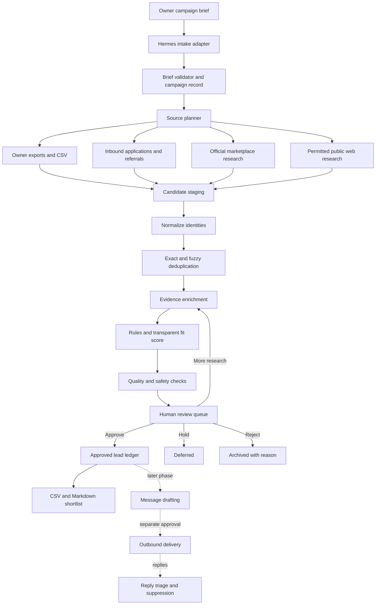

# Hermes Lead Generation Pilot: Findings and Build Architecture

**Brand:** iamtoxico  
**Prepared:** 2026-08-09  
**Recommended first pass:** generate and qualify leads; do not automate outreach yet  
**Status:** build proposal based on the running Hermes installation

## Executive Recommendation

Hermes should first be extended into a supervised lead-research system, not a fully autonomous outreach agent.

The pilot should accept a narrowly defined campaign brief, generate candidate creator/model/partner leads from permitted sources, normalize and deduplicate those candidates, research public evidence, assign a transparent fit score, and produce a reviewable shortlist. It should stop at an explicit human decision: **approve, reject, hold, or request more research**.

This is the right first test because it exercises the parts Hermes already performs well—email intake, durable job handling, research, structured output, auditing, and operator review—without immediately introducing the highest-risk parts: bulk sending, platform automation, negotiations, opt-outs, deliverability, and brand-reputation damage.

The smallest useful product is therefore:

> A campaign brief goes into Hermes; an evidence-backed, deduplicated, exportable list of qualified leads comes out.

Only after the first 25–50 reviewed leads show acceptable precision should the system draft outreach. Sending should remain separately gated until reply handling, suppression, sender identity, and compliance controls have been tested.

## Findings From the Existing Hermes Runtime

### 1. Hermes already has a dependable intake pattern

The running implementation uses Gmail IMAP IDLE to receive messages, recognizes subject-token commands, and sends unrecognized work into the universal research queue. The current operator mailbox is `labsmelodic@gmail.com`.

This is useful for the pilot because a campaign can initially be initiated by email without building a new interface. For example:

```text
Subject: leads

Campaign: Toxico micro-creator pilot
Goal: Find US-based fashion and nightlife creators for product seeding
Quantity: 25
Geography: New York, Philadelphia, Baltimore, Washington DC
Follower band: 2,000–50,000
Required: public business contact or platform-native collaboration availability
Exclude: minors, repost-only accounts, obvious engagement fraud
```

The email channel should be treated as an operator command surface, however, not as the eventual outbound marketing identity.

### 2. Work is already decoupled from email receipt

Hermes does not need to finish a long job inside the IMAP loop. Raw inbound email is written atomically to a file-backed queue; a worker claims it by rename, moves successful work to `email_done`, and moves errors to `email_failed`. Stale in-flight work can be reclaimed after a timeout.

That is the correct basic reliability model for lead research. A slow source or failed enrichment should not block receipt of the next brief, and a restart should not silently lose work.

Observed runtime evidence at review time:

- 86 email messages archived in `email_done`;
- 500 jobs archived in `research_done`;
- no pending or failed items appeared in the sampled top-level queue counts;
- IMAP disconnects are logged and followed by reconnect attempts;
- runtime state has been moved to the internal SSD because background access to external/iCloud-backed paths had caused blocking behavior.

This evidence does not prove every result is high quality, but it does show the transport and job lifecycle have been exercised beyond a one-off demo.

### 3. The universal research pipeline is reusable

The current work queue uses a single `research` job type and records a detected subtype inside each payload. The research runner interprets requests, uses sub-behaviors, writes structured state, and has already produced a large body of research output.

Lead generation should be added as a campaign-oriented research behavior rather than as a second independent agent framework. The new behavior can reuse:

- job identifiers and timestamps;
- source attribution;
- attachments;
- atomic state transitions;
- research execution;
- structured output conventions;
- action logging;
- existing local-model and external-tool routing.

The lead domain does need stricter schemas than a general research note. A prose report alone is insufficient because prospects must be deduplicated, rescored, approved, suppressed, exported, and later reconciled with messages and commercial outcomes.

### 4. Audit and write controls are already part of the design

Hermes appends decisions to `actions.jsonl`, and its write gate explicitly allows operational surfaces while denying site repositories, `.git`, credentials, and system paths. This is a good foundation for a marketing workflow where it must be possible to answer:

- Who or what created this lead?
- Which public source justified the record?
- Which scoring version was used?
- Did a human approve the prospect?
- Was a particular message approved?
- Was the person suppressed before a later send attempt?

The existing action log should remain the operational audit stream, while durable campaign approvals should also live as first-class database rows. A log event by itself is inconvenient as the only source of truth for current workflow state.

### 5. Hermes already favors human delegation at sensitive boundaries

The current write policy distinguishes research/operator behavior from repository editing. The same pattern should be applied to recruiting:

- the **research role** may discover, normalize, enrich, and score;
- the **review role** may approve or reject prospects;
- the **draft role** may prepare messages for approved prospects;
- the **send role** may send only a specifically approved message to a specifically approved contact through an allowed channel;
- the **owner** handles negotiation, compensation, rights, sensitive information, and exceptions.

These should be database-enforced capabilities, not just prompt instructions.

### 6. The current Gmail identity is poorly matched to external outreach

`labsmelodic@gmail.com` works as an internal Hermes command mailbox. It is not the best public-facing identity for iamtoxico recruiting because:

- the domain and sender name do not immediately match the brand;
- operator commands, automated confirmations, research replies, creator responses, bounces, and opt-outs would share one inbox;
- access and reputation changes for one workflow would affect the others;
- filtering and reply ownership become harder as volume grows;
- recipients may reasonably question whether the message is official.

Create a separate branded address before any outbound pilot. Recommended primary identity:

```text
collabs@iamtoxico.com
Display name: Toxico Collaborations
Reply-to: collabs@iamtoxico.com
```

Good alternatives are `creators@iamtoxico.com` for a creator-only program or `studio@iamtoxico.com` for casting and production. `hello@` is too general, and `no-reply@` is inappropriate for relationship-building.

Keep `labsmelodic@gmail.com` as the private operator/control inbox. Do not merely add a From alias and continue mixing all mail in one mailbox if a separate mailbox is affordable. A true separate mailbox gives cleaner access control, threading, suppression handling, and reputation isolation. If cost is a concern, an alias can be used for the lead-generation-only phase because no outbound mail is sent, but it should be upgraded to a real mailbox before sending.

Before outbound use, configure and verify SPF, DKIM, and DMARC for `iamtoxico.com`; use a stable human-readable signature, a monitored reply path, a valid business postal address where legally required, and a one-step opt-out process. Start with individual messages at very low volume rather than attempting to “warm” the address with artificial traffic.

## Pilot Scope

### In scope

- one brand and one campaign at a time;
- creator, affiliate, UGC, model, photographer, stylist, agency, retailer, or collaboration lead types;
- owner-provided exports, inbound applications, referrals, official marketplaces, and permitted public business sources;
- public professional facts and evidence URLs;
- normalization, cross-source deduplication, transparent scoring, risk flags, and owner review;
- CSV and Markdown exports;
- weekly quality reporting.

### Explicitly out of scope for pass one

- automated DMs;
- bulk cold email;
- scraping gated social platforms or bypassing platform controls;
- automatic acceptance or rejection based on protected or inferred sensitive traits;
- automatic offer setting;
- sending samples;
- negotiating fees or usage rights;
- collecting identity documents, home addresses, sizing, tax, or payment data;
- replacing Shopify Collabs, TikTok Shop, or native marketplace attribution.

## Proposed System Architecture



### Component responsibilities

#### Intake adapter

Accepts a lead brief through the existing email path, a local CLI command, or a JSON file. It creates a campaign and queues a `lead_discovery` research job. Attachments such as source CSVs are retained using the current attachment mechanism.

#### Brief validator

Rejects ambiguous or unsafe jobs before research begins. Required fields:

- campaign name and business objective;
- lead type;
- desired quantity;
- permitted sources;
- geography, if any;
- inclusion and exclusion rules;
- offer context, even if outreach is not yet enabled;
- required evidence/contact basis;
- scoring rubric version;
- maximum research budget and deadline.

It should warn when a request appears to target sensitive traits, minors, personal rather than business contact information, or a source whose terms do not support the proposed collection method.

#### Source planner

Turns the brief into source-specific tasks. It should record why a source is permitted and whether discovery is automated, manual, or based on an owner-provided export.

The source adapter interface should be simple:

```python
class LeadSource:
    name: str

    def plan(self, campaign: Campaign) -> list[SourceQuery]: ...
    def discover(self, query: SourceQuery) -> list[RawCandidate]: ...
    def checkpoint(self) -> dict: ...
```

Do not make “scrape any site” the abstraction. Each source needs an explicit collection policy and evidence model.

#### Candidate staging

Stores raw source results without treating them as approved contacts. Every raw candidate should retain source URL, capture time, source-specific identifier, and the original public fields used to construct the record.

#### Identity resolution and deduplication

Perform deterministic matching first:

- canonicalized email;
- canonical platform URL and handle;
- official website domain;
- platform-specific creator ID, when legitimately available.

Then generate possible duplicates using normalized names, linked websites, overlapping handles, geography, and cross-linked profiles. Fuzzy matches must be reviewable; they should not silently merge two people. Store merges as reversible alias relationships.

#### Evidence enrichment

Research only what is needed to judge the campaign. A creator record may include:

- short fit summary;
- profile and portfolio URLs;
- public business contact path;
- city/region when publicly stated for professional use;
- relevant recent content examples;
- audience/category notes;
- collaboration or affiliate evidence;
- engagement-quality observations;
- reliability and safety flags;
- evidence URL and verification timestamp for every material claim.

The system must distinguish `observed`, `reported_by_source`, `calculated`, and `model_inference`. Low-confidence model inferences should not be exported as facts.

#### Scoring engine

Use a versioned, inspectable weighted score rather than an opaque model-only ranking. Recommended initial rubric:

| Criterion | Weight | Required evidence |
|---|---:|---|
| Brand/aesthetic fit | 25 | Two relevant public examples or a clear portfolio pattern |
| Content/portfolio quality | 20 | Specific notes on execution and consistency |
| Audience or professional relevance | 15 | Public topical/category evidence |
| Engagement quality | 15 | Qualitative interaction evidence; not follower count alone |
| Reliability/professionalism | 10 | Posting consistency, portfolio, prior work, or professional contact route |
| Geography/logistics | 5 | Public professional location evidence when relevant |
| Commercial readiness | 5 | Business email, manager, marketplace, media kit, or affiliate history |
| Brand safety/fraud risk | 5 | Explicit flags and uncertainty, never sensitive-trait screening |

Store every component score, evidence, explanation, model/version identifier, and final weighted result. Let campaign-specific thresholds prioritize review, but never auto-send or permanently auto-reject from score alone.

#### Quality and safety checks

Before a lead reaches review:

- require at least one stable profile or business URL;
- require evidence timestamps;
- validate email syntax without sending a verification email;
- reject obvious role/personal-address confusion;
- check the existing lead ledger for duplicates and suppression;
- flag unverifiable follower/engagement claims;
- ensure the lead is believed to be an adult for adult-only recruiting, without collecting documents;
- ensure no protected-characteristic inference is present;
- attach a clear statement of uncertainty.

#### Human review queue

The first interface can be a generated Markdown report plus CSV, with a CLI command writing decisions back to SQLite. Each prospect card should show:

- name/handle and lead type;
- source and evidence links;
- concise “why this fits” explanation;
- score breakdown;
- public business contact availability, without exposing unnecessary data;
- risks and uncertainties;
- duplicate/suppression status;
- suggested next action;
- approve, reject, hold, and research-more decision fields.

The system should never interpret opening a report as approval.

## Canonical Data Model

SQLite is sufficient for the pilot. Use normalized tables rather than one JSON blob, while retaining raw source payloads for audit and replay.

```text
campaign
  id, name, objective, lead_type, status
  target_count, geography_json, inclusion_json, exclusion_json
  permitted_sources_json, scorecard_version
  created_by, created_at, approved_at, completed_at

source_run
  id, campaign_id, source_name, collection_mode
  query_json, policy_basis, status, cursor_json
  started_at, completed_at, error

raw_candidate
  id, campaign_id, source_run_id, source_external_id
  source_url, captured_at, raw_json, content_hash

lead
  id, display_name, lead_type, stage
  city, region, country, official_site
  summary, first_seen_at, last_verified_at
  do_not_contact_at, suppression_reason

lead_identity
  id, lead_id, platform, handle, canonical_url
  external_id, is_primary, verified_at

contact_point
  id, lead_id, kind, normalized_value, display_value
  public_source_url, permission_basis, verified_at
  status, suppressed_at

evidence
  id, lead_id, campaign_id, field_name
  claim, evidence_type, source_url, observed_at
  confidence, raw_candidate_id

score
  id, lead_id, campaign_id, rubric_version
  component_json, total, explanation
  model_name, prompt_version, scored_at

lead_relationship
  from_lead_id, to_lead_id, relationship_type
  confidence, evidence_id, reviewed_at

review_decision
  id, campaign_id, lead_id, decision
  reason_code, notes, decided_by, decided_at

outreach_approval              # create now; use only in later phase
  id, campaign_id, lead_id, message_id
  status, approved_by, approved_at, revoked_at

message                        # later phase
  id, campaign_id, lead_id, channel, direction
  subject, body, status, provider_message_id
  drafted_at, approved_at, sent_at, replied_at

audit_event
  id, actor_type, actor_id, action
  entity_type, entity_id, details_json, created_at
```

Important constraints:

- unique normalized email when non-null;
- unique `(platform, external_id)` when available;
- unique canonical platform URL;
- no approved lead without a `review_decision` event;
- no approved outbound message without both prospect and message approval;
- no send when any matching identity or contact point is suppressed;
- rejection and suppression are different states;
- raw source data is immutable; corrections create new evidence or verification records.

## Suggested Repository Layout

Keep the extension inside the existing Hermes runtime until it proves it needs to become a service:

```text
hermes-runtime/
  leads/
    __init__.py
    models.py              # dataclasses/domain objects
    schemas.py             # input/output validation
    db.py                  # SQLite connection and migrations
    repository.py          # persistence operations
    brief.py               # campaign validation
    normalize.py           # URLs, handles, names, email normalization
    dedupe.py              # deterministic and candidate fuzzy matches
    enrich.py              # evidence-oriented research coordinator
    scoring.py             # versioned transparent rubric
    review.py              # review packet and decision import
    export.py              # CSV/Markdown output
    policy.py              # collection/outreach/source rules
    sources/
      base.py
      csv_import.py
      inbound.py
      public_web.py
      manual_marketplace.py
  ingest/
    lead_runner.py         # adapter from universal research job
  state/
    leads.sqlite3          # runtime only; excluded from source control
    lead_exports/
  tests/
    test_lead_brief.py
    test_lead_normalize.py
    test_lead_dedupe.py
    test_lead_scoring.py
    test_lead_approvals.py
    test_lead_suppression.py
```

## Technology Stack

### Use now

- **Language:** Python 3.12, matching the active Hermes modules.
- **Validation:** Pydantic 2 for campaign, candidate, evidence, and export schemas. Dataclasses are acceptable internally, but boundary payloads need strict validation and schema versions.
- **Database:** SQLite in WAL mode with foreign keys enabled. Use SQLAlchemy 2 plus Alembic if the schema will evolve rapidly; otherwise a small explicit `sqlite3` repository and numbered SQL migrations is adequate. Given approvals and future messages, SQLAlchemy/Alembic is the safer long-term choice.
- **Queue:** retain the existing file-backed atomic queue for coarse jobs. Do not introduce Redis for a single-machine pilot.
- **Research orchestration:** reuse `research_runner` and existing tools, adding structured lead outputs and source-policy checks.
- **Reports:** Markdown for human readability and CSV for sorting/import. Add JSONL for replay and machine inspection.
- **Scheduling:** current launchd/Hermes worker pattern for nightly retry, stale-lead verification, and weekly reporting.
- **Testing:** pytest for unit and workflow tests; use fixed source fixtures so scoring/dedupe tests do not depend on live websites.
- **Logging:** existing append-only `actions.jsonl`, with campaign/job/lead correlation IDs in every new event.
- **Secrets:** existing `~/.hermes/.env` loading for operator credentials. Add separate namespaced variables for the brand mailbox later; never store secrets in SQLite, exports, or source control.
- **Email for pass one:** inbound operator commands only. No automated outbound delivery.

### Add for the outbound phase

- **Mailbox:** a real `collabs@iamtoxico.com` mailbox on the domain's managed mail provider.
- **Delivery integration:** provider API preferred over ad hoc SMTP if it supplies delivery, bounce, complaint, and webhook events. IMAP can remain the inbound fallback.
- **Inbound threading:** map `Message-ID`, `In-Reply-To`, and `References` to the canonical message record.
- **Webhook receiver:** a small FastAPI service only when provider callbacks are enabled.
- **Suppression processor:** synchronous check before every send plus immediate bounce, complaint, and opt-out updates.
- **Template rendering:** Jinja2 with locked compliance/footer blocks and campaign-versioned templates.

### Add only after demonstrated need

- **PostgreSQL:** when multiple machines/users write concurrently, the dashboard becomes always-on, or webhook volume makes SQLite locking operationally painful.
- **FastAPI admin API:** when CLI/Markdown review becomes the bottleneck.
- **Server-rendered admin UI:** HTMX/Jinja or a similarly small interface is adequate for review. React/Next.js is unnecessary unless the broader site team already standardizes on it or the interface becomes interaction-heavy.
- **Redis and a worker framework:** only for multiple concurrent workers, delayed jobs, provider webhooks, or rate-controlled sends that cannot be handled by the current queue.
- **Object storage:** only if contracts, large portfolios, or authorized media need controlled retention. Do not download creator media merely because it is technically possible.
- **Analytics dashboard:** Metabase or direct SQL reports once campaign volume exceeds what weekly CSV review can explain.

### Do not add for this pilot

- vector database;
- Kubernetes;
- multi-agent framework replacement;
- generalized social scraper;
- headless-browser DM automation;
- a custom CRM before the workflow is stable;
- a second affiliate attribution system competing with Shopify or TikTok;
- automatic email-finding/enrichment vendors without a specific legal, quality, and source-provenance review.

## Job and State Design

A lead job should be resumable and idempotent:

```json
{
  "schema_version": 1,
  "kind": "research",
  "payload": {
    "detected_kind": "lead-discovery",
    "campaign_id": "cmp_...",
    "requested_count": 25,
    "stage": "discover",
    "source_names": ["owner_csv", "public_web"],
    "budget": {
      "max_candidates": 100,
      "max_enrichments": 40,
      "deadline_seconds": 1800
    }
  }
}
```

Recommended job stages:

```text
brief_validated
source_planned
discovered
normalized
deduplicated
enriched
scored
quality_checked
review_packet_ready
completed
```

Each transition should be safe to run twice. Insert/update operations need idempotency keys based on campaign, source, and source external ID or canonical URL. A failure should record the last successful stage and retry only the unfinished portion.

Quarantine malformed source data rather than failing the whole campaign. A campaign can complete as `partial` with an explicit count of failed candidates and source errors.

## Lead Review Output

The primary artifact should be useful without opening a dashboard:

```text
# Campaign: Toxico NYC Micro-Creators — Review 01

Discovered: 74
Unique after dedupe: 58
Enriched: 32
Passed minimum evidence: 25
Recommended for review: 15
Source errors: 2

## Candidate 01 — @example
Lead type: creator / UGC
Weighted score: 82/100
Why: Three recent styling posts align with the campaign's nightlife/streetwear brief...
Evidence: [profile], [example 1], [example 2]
Business contact: public email present; last verified 2026-08-09
Risks/uncertainty: audience geography is not verified
Duplicate status: no known match
Suggested decision: approve for outreach drafting
Owner decision: [ ] approve [ ] reject [ ] hold [ ] research more
Reason/notes:
```

CSV columns should include stable IDs, not just names, so reviewed files can be imported safely.

## Email and Identity Architecture

Use three logically separate mail roles:

| Role | Suggested address | Purpose | Human visibility |
|---|---|---|---|
| Operator/control | current `labsmelodic@gmail.com` | Send commands to Hermes and receive internal results | Private |
| Brand collaborations | `collabs@iamtoxico.com` | Creator/affiliate/model business conversations | Shared with owner/operator |
| Automated system events | optional `hermes@iamtoxico.com` or provider subaddress | Internal alerts, bounces, processing failures | Private; never the relationship sender |

For the smallest pilot, only the first role is required because Hermes generates leads but sends nothing. Create the collaborations mailbox during the pilot so the address, domain authentication, signature, access controls, and reply-routing can be tested before live outreach.

Do not expose the control inbox in public forms or message footers. Inbound applications should go to a branded form or collaborations mailbox and be converted into consented lead records with their original submission timestamp and stated preferences.

## Approval Model for Later Outreach

Outbound automation must require independent gates:

1. Campaign is approved.
2. Prospect is approved for this campaign.
3. Contact point is allowed for this use and is not suppressed.
4. Offer version is approved.
5. Exact message body and subject are approved.
6. Daily/channel limit permits sending.
7. A final synchronous suppression check passes.

Pseudocode:

```python
def authorize_send(message_id: str) -> SendAuthorization:
    message = messages.get_for_update(message_id)
    require(message.status == "approved")
    require(campaigns.is_approved(message.campaign_id))
    require(reviews.is_prospect_approved(message.campaign_id, message.lead_id))
    require(offers.is_approved(message.offer_id))
    require(not suppression.matches(message.lead_id, message.contact_point_id))
    require(limits.can_send(message.channel))
    return SendAuthorization.single_use(message_id)
```

The authorization should be single-use and consumed atomically with creation of the send attempt.

## Measurement Plan

### Pass-one metrics: lead quality

- raw candidates found per source;
- unique candidates after deduplication;
- percentage with sufficient evidence;
- percentage with a legitimate business contact or native marketplace route;
- human approval rate;
- reject reasons by source;
- false-merge and missed-duplicate rate;
- research cost and time per approved lead;
- evidence freshness;
- percentage of factual claims corrected by the reviewer;
- reviewer time per candidate.

The key pilot metric is **precision among the top-ranked leads**: of the first 10 or 20 Hermes recommends, how many would the owner genuinely want to contact?

### Later metrics: outreach and economics

- delivery and bounce rate;
- positive reply rate;
- opt-out and complaint rate;
- acceptance and sample-claim rate;
- content delivery and usable-content rate;
- affiliate activation, orders, revenue, gross margin, and commission;
- cost per usable asset and cost per acquired customer;
- renewal/second-collaboration rate;
- adequate disclosure rate.

## Acceptance Criteria for the First Test

Run one real campaign with a target of 25 qualified records. The pilot passes when:

- all 25 have stable IDs and at least one evidence URL;
- every material summary claim has evidence or is labeled as inference;
- there are no known unflagged duplicates in the final list;
- at least 70% of the top 10 recommendations are approved or held for a plausible campaign reason;
- no prohibited sensitive traits appear in collection or scoring;
- every review decision is recorded with actor and timestamp;
- rerunning the same source inputs does not duplicate leads;
- a deliberately malformed candidate is quarantined without losing the campaign;
- a deliberately suppressed test contact cannot become send-eligible;
- the owner can review the result without reading raw JSON or logs.

If fewer than 70% of the top 10 are viable, improve the brief, evidence requirements, source mix, and scoring rubric before adding message generation.

## Detailed Build Sequence

### Milestone 0: freeze the pilot contract

1. Choose one lead type and one actual iamtoxico offer.
2. Approve the brief schema and scoring rubric.
3. Define permitted sources for this campaign.
4. Define rejection reason codes.
5. Decide who may approve leads.
6. Select `collabs@iamtoxico.com` or another branded mailbox name.

Deliverable: one versioned campaign brief fixture and one hand-scored example set.

### Milestone 1: ledger and imports

1. Add SQLite migrations and domain schemas.
2. Add campaign creation by CLI/JSON.
3. Add CSV and manual candidate import.
4. Add raw payload retention and source provenance.
5. Add deterministic normalization and dedupe.
6. Add Markdown/CSV exports.
7. Add fixtures and unit tests.

Deliverable: owner-provided candidates can be imported, deduplicated, and reviewed without AI enrichment.

### Milestone 2: Hermes research integration

1. Add a `lead-discovery` classifier/behavior.
2. Convert an email brief into a campaign job.
3. Implement evidence-oriented enrichment with strict structured output.
4. Store evidence per claim.
5. Add scoring and confidence handling.
6. Generate the review packet.
7. Log each stage with campaign and lead IDs.

Deliverable: an email or CLI brief produces a research-backed shortlist.

### Milestone 3: owner review loop

1. Import approve/reject/hold/research-more decisions.
2. Requeue only research-more candidates.
3. Preserve scoring revisions and decision history.
4. Add summary metrics and rejection analysis.
5. Run the 25-lead acceptance test.

Deliverable: a complete supervised learning loop without outbound communication.

### Milestone 4: mailbox preparation

1. Provision the branded collaborations mailbox.
2. Configure SPF, DKIM, and DMARC.
3. Set display name, signature, reply ownership, and opt-out handling.
4. Test inbound/outbound threading between internal accounts only.
5. Store bounce/opt-out fixtures and test suppression.

Deliverable: a safe sender identity, still with no autonomous live outreach.

### Milestone 5: drafting, then controlled sending

1. Generate drafts only for approved prospects.
2. Add immutable message versions and exact-message approval.
3. Add the synchronous send authorization gate.
4. Send the first 5–10 messages individually with owner approval.
5. Classify replies and draft responses; do not auto-negotiate.
6. Review results before any increase in volume.

Deliverable: a low-volume, auditable outreach loop with immediate suppression.

## Operational Risks and Mitigations

| Risk | Likely failure | Mitigation |
|---|---|---|
| Research hallucination | Invented biography, contact, or personalization | Evidence per claim; confidence labels; reviewer sees source links |
| Duplicate identity | Same creator contacted twice under different handles | Deterministic keys, candidate duplicate queue, reversible merges |
| Personal email misuse | Outreach goes to an address not offered for business use | Store permission/source basis; prefer native marketplaces and public business contacts |
| Platform violation | Scraper or bot exceeds permitted access | Explicit source adapters and collection modes; no generalized browser bot |
| Weak brand fit | High-volume but unusable list | Narrow brief, weighted score, top-ranked precision metric |
| Bias in selection | Sensitive traits inferred or used as proxies | Prohibited-field checks, transparent rubric, human review, audit samples |
| Lost work after restart | Campaign restarts from the beginning or duplicates records | Existing atomic queue plus staged checkpoints and idempotency keys |
| Mail reputation damage | Bounces, complaints, or confusing sender identity | Separate branded mailbox, authentication, low volume, suppression, monitored replies |
| Approval ambiguity | Draft or lead is assumed approved | First-class explicit decisions; exact-message approval; single-use send token |
| Overbuilding | Dashboard and integrations precede workflow proof | SQLite, CLI, Markdown, and CSV through the first 25–50 leads |

## Final Architecture Decision

Build the lead ledger and review loop as a domain module inside Hermes, using its current email intake, atomic file queue, research runner, audit log, launchd operations, and write controls. Use SQLite and generated review artifacts for the pilot. Do not introduce a new agent platform, queue service, dashboard, or social automation layer.

The immediate build target is one commandable pipeline:

```text
brief -> source plan -> candidates -> dedupe -> evidence -> score -> review packet -> owner decisions
```

Prepare `collabs@iamtoxico.com` in parallel, but keep it out of automated sending until the lead-quality test passes and the suppression/approval system is implemented. This separates the first question—**can Hermes reliably find people worth contacting?**—from the later question—**can Hermes safely help manage the relationship?**
