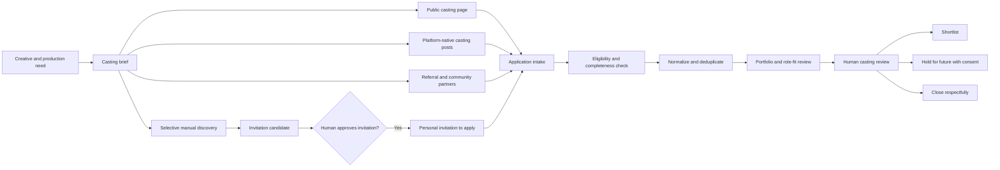

# Model Sourcing: Front-of-Funnel Architecture

**Brand:** iamtoxico  
**Scope:** discovery through qualified casting pool  
**Boundary:** ends before booking, contracting, payment, travel, or shoot management  
**Operating principle:** publish clear opportunities, invite selectively, capture consent, and make human taste the final gate

## What the Front of the Funnel Must Produce

The goal is not a giant list of attractive profiles. It is a healthy, permission-aware pool of people who fit a specific creative job and have enough verified information for a human casting decision.

For every sourcing campaign, the front end should produce:

- a clearly defined casting need;
- a diverse source mix rather than dependence on one platform;
- traceable candidates with source and consent history;
- comparable application materials;
- a distinction between models, creator-models, UGC creators, and ambassadors;
- a shortlist with evidence, availability confidence, and open questions;
- a respectful rejection/hold path;
- reusable talent relationships when applicants opt into future opportunities.

The funnel ends at `casting_shortlist`. A person should not become “booked” merely because Hermes scored them highly.



## Start With the Job, Not the Person

Every sourcing run needs a production-backed casting brief. “Find models for Toxico” is too vague and will create inconsistent selection, weak outreach, and rights/compensation confusion.

### Required casting-brief fields

```text
Campaign title
Creative objective
Products or looks being shown
Role type
Shoot format and location
Shoot date or date window
Estimated time commitment
Number of people needed
Compensation structure and range
Travel/parking policy
Wardrobe and styling plan
Required deliverables
Intended usage
Usage duration and territory
Exclusivity, if any
Posting requirement, if any
Age minimum
Genuine garment-fit requirements
Accessibility/accommodation contact
Application deadline
Decision timeline
Named human casting owner
```

Do not source until compensation and usage can be described honestly. “Exposure,” a possible affiliate commission, and a product sample are not substitutes for a clear rate when the brand requires attendance, posing, or licensed deliverables.

## Separate the Talent Lanes

One person can qualify for several lanes, but each lane must have its own expectations.

| Lane | What iamtoxico is buying or requesting | What matters at sourcing | Typical front-door CTA |
|---|---|---|---|
| E-commerce model | Fit and product presentation | garment fit, movement, reliability, clean product images | Apply for a named shoot |
| Editorial/lifestyle model | Presence inside a brand story | visual character, range, collaboration, concept fit | Submit portfolio for casting |
| Fit model | Consistent garment measurements and fit feedback | precise current measurements, availability, repeatability | Apply to fit-model roster |
| UGC creator | Self-produced usable content | camera presence, home production quality, editing, delivery record | Pitch a UGC concept |
| Creator-model | Appearance plus distribution to their audience | modeling fit and audience/community fit | Apply to creator campaign |
| Ambassador | Ongoing brand relationship | authentic affinity, reliability, community trust | Join talent/community roster |
| Event/promotional talent | Live public representation | communication, punctuality, location, event comfort | Apply for event staffing/casting |

Do not quietly add a posting requirement to a modeling role. If the brand wants reach, that is a creator deliverable and should be priced and consented to separately.

## Recommended Acquisition Mix

For the first real casting, use four acquisition loops in parallel. This creates enough variety to compare quality without building uncontrolled volume.

### Loop 1: owned inbound casting page

The primary front door should be a page on `iamtoxico.com`, such as:

```text
iamtoxico.com/casting
iamtoxico.com/casting/{campaign-slug}
```

This is the canonical description of the opportunity. Every social post, referral, QR code, casting platform post, and personal invitation should point back to it when platform rules allow.

Advantages:

- Toxico controls clarity, consent language, accessibility, and analytics;
- applicants see a credible brand context before sharing information;
- all sources enter one comparable workflow;
- campaign-specific questions can be changed without rewriting every channel post;
- future-opportunity consent is captured separately;
- source codes allow channel measurement.

The page should feel like a real casting notice, not a generic marketing lead form.

### Loop 2: platform-native casting

Use casting platforms for applicants already seeking formal work. Model Mayhem can be useful for local independent talent when operated through a legitimate Talent Recruiter profile and native casting tools. Formal paid productions can also justify services such as Backstage or Casting Networks depending on budget and market.

Hermes should:

- draft the casting text from the canonical brief;
- produce platform-specific short versions;
- create a checklist for required platform fields;
- ingest applications through an owner export or manual entry;
- preserve the platform source and profile URL;
- never scrape or operate a platform account autonomously.

Platform applicants may be more production-ready, but the brand should expect portfolio style, rate norms, and response behavior to vary by market.

### Loop 3: partner and community referrals

High-quality early talent often comes through trusted local networks:

- photographers, stylists, makeup artists, and creative directors;
- fashion/design/photo programs and official student organizations;
- boutiques, studios, galleries, nightlife venues, dance communities, and art collectives;
- existing collaborators and customers who explicitly opt in;
- local agencies and mother agencies;
- previously approved models and creators.

Give each partner a campaign link with a source code, not a spreadsheet of private contacts. Ask partners to share the open call or make a warm introduction. Do not ask a school or collaborator to hand over personal student/customer information.

Referral quality should be measured separately from application count. Ten thoughtful introductions can outperform hundreds of low-intent form entries.

### Loop 4: selective outbound invitation to apply

Manual discovery is useful when the brief calls for a particular aesthetic, skill, location, or community that inbound channels are not reaching.

Permitted workflow:

1. A researcher finds a public professional profile through normal browsing, a native marketplace, a credited editorial, an agency roster, or a collaborator referral.
2. Hermes creates a **discovery candidate**, not an applicant.
3. Hermes records only the public evidence needed to explain potential fit.
4. A human approves whether the person should be invited.
5. The invitation is sent through a platform-native business channel or public business contact.
6. The person chooses whether to open the casting page and apply.

This keeps the candidate in control. Discovery does not imply consent to retain a detailed dossier, market to them indefinitely, or contact them across several channels.

## Channel-by-Channel Sourcing Plan

### The iamtoxico casting page

Best for all campaigns and the canonical source of truth. Promote it in the site navigation only when casting is active; otherwise keep a lower-intensity “join the talent roster” page with honest expectations.

Recommended calls to action:

- `apply for this shoot` for a scheduled job;
- `join the future casting roster` for a general opt-in;
- `refer someone` for partners, using a flow that asks the referred person to submit themselves;
- `request an accommodation` through a monitored human contact.

Do not conflate an active paid casting with a general mailing-list signup.

### Instagram

Best for visual discovery, local creative networks, photographers, stylists, editorial models, and creator-models.

Use:

- an organic casting post and Story highlight;
- collaborator reposts;
- location and niche discovery performed manually;
- Creator Marketplace where relevant to the creator component;
- personal, specific invitations to the application page after approval.

Avoid:

- automated profile harvesting;
- mass DMs;
- evaluating only a single highly edited grid;
- treating follower count as modeling ability;
- requesting sensitive information in DMs.

### TikTok

Best for camera presence, motion, styling energy, UGC, and creator-model hybrids. TikTok Shop's affiliate tools are appropriate when the role includes product promotion, but a traditional shoot should still be described as a production job.

The front end can use a short casting video explaining the concept, compensation type, location, and application link. Applicants should submit the same canonical form; comments and DMs are discovery/conversation surfaces, not the system of record.

### Model Mayhem and casting services

Best for production-oriented models and crew. Post only defined opportunities with real dates or windows, compensation, usage, and location. Keep all candidate discovery and initial interaction within the platform's expected workflow unless the candidate applies through the brand page.

### Agencies

Best when the production needs higher booking reliability, specific commercial experience, or managed rights. Contact the agency's official booking address with a professional brief rather than mining individual model contacts.

Hermes should maintain agency records separately from individual talent. The agency may be the authorized contact and contracting party.

### Local creative networks

Best for distinctive editorial work, emerging talent, and relationship density. Build a source map by city:

```text
photographers -> models they have credited
stylists -> local shoots and designers
makeup artists -> production collaborators
venues/galleries -> event and culture communities
schools/programs -> official opportunity boards
existing talent -> referrals
```

The system should trace how a person was found without importing unrelated people from their social graph.

### Existing customers and community

Potentially strong for authentic fit and brand affinity. Use an opt-in call such as “Want to appear in Toxico content?” Do not infer willingness from purchase history or use shipping details as casting contact information without clear consent.

## The Casting Landing Page

### Page structure

1. **Hero:** campaign name, city, date window, paid/product/trade label.
2. **The concept:** 100–200 words plus a small approved moodboard.
3. **Who the project needs:** role-relevant, inclusive language.
4. **What happens:** location type, duration, team, wardrobe, changing/privacy conditions, and accessibility notes.
5. **Compensation:** rate/range, product, travel, payment timing, and what is not included.
6. **Usage:** exactly where content may appear and for how long.
7. **Requirements:** only genuine production and garment-fit requirements.
8. **Timeline:** deadline, callback period, shoot, and notification policy.
9. **Application form:** progressive, minimal, mobile-friendly.
10. **Trust footer:** brand contact, privacy notice, safety statement, and no-fee assurance.

### Trust and safety copy

The page should explicitly say:

- iamtoxico never charges applicants a casting or representation fee;
- applicants must be 18+ for the initial program;
- no nude images or intimate submissions are requested;
- tax, banking, government ID, and full home address are not collected at application;
- selected talent will receive written terms before commitment;
- the named contact channel is the place to verify the casting;
- accommodation requests are welcome and reviewed by a person;
- an application is not a booking guarantee.

This is particularly important for an edgy brand name or lingerie/loungewear product category, where candidates need unambiguous professional boundaries.

## Application Design

Use progressive disclosure. The first application should collect what is necessary to evaluate fit—not everything production might eventually require.

### Stage A: basic application

Required:

- chosen/professional name;
- email address;
- age confirmation (`I am 18 or older`), not birth date;
- general city/region, not street address;
- role(s) sought;
- portfolio or professional social link;
- two or three recent, relevant images or links;
- availability for the stated date/window;
- acknowledgment of compensation and usage summary;
- consent to process the application for this casting;
- how they heard about the opportunity.

Optional:

- phone number, with clear text/call consent if collected;
- agency/manager and booking contact;
- pronouns;
- experience summary;
- accessibility/accommodation request;
- optional consent to future casting notices;
- a short “why this concept” response;
- self-tape or motion clip only when the role genuinely needs it.

### Stage B: fit information

Only show garment-related questions when required for the products being photographed. Prefer current garment sizes and brand-specific size-chart questions over broad body profiling.

Potential fields:

- usual top/bottom/dress size;
- shoe size;
- height when production or garment length requires it;
- limited measurements needed to match samples;
- fit notes or mobility considerations supplied voluntarily.

Explain why each measurement is requested and who can see it. Allow “prefer to discuss at callback” where operationally possible. Do not use measurements as a proxy for beauty or worth.

### Stage C: callback details

Collect only after a human advances the candidate:

- more exact availability;
- callback/self-tape instructions;
- current digitals if needed;
- agent confirmation;
- travel constraints;
- additional fit details;
- conflict/exclusivity questions genuinely tied to the campaign.

### Booking stage—not front of funnel

Government name, contract signature, payment/tax information, full address, emergency contact, identity/age verification when necessary, and detailed travel arrangements belong in a separate secure booking workflow. They should never be requested through casual DMs or stored in the general lead ledger.

## Image and Portfolio Submission Rules

Ask for the minimum material necessary:

- one clear face/upper-body image;
- one full-length image when full-garment fit matters;
- one portfolio/editorial link or relevant movement/video example;
- recent, lightly edited material preferred;
- ordinary fitted clothing is sufficient for initial fit visibility.

Never request nude, partially nude, or sexually explicit images at application. Avoid telling applicants to purchase a product or professional photo package to qualify. Set file size/type limits and allow URL submissions to reduce sensitive media storage.

Uploaded media needs:

- private storage outside the public web root;
- random object names, not applicant names;
- malware/type validation;
- short retention for rejected applications unless future-roster consent exists;
- access logging;
- deletion workflow;
- no model-training use unless separately and explicitly consented to.

## Consent Model

Use separate unchecked choices:

```text
[required] I consent to iamtoxico using this application to evaluate me for [campaign].
[optional] I would like iamtoxico to retain my application for future casting opportunities for 12 months.
[optional] I would like to receive general brand marketing.
[optional] I agree to be contacted by text about this casting.
```

Future casting, general marketing, and text messaging are different purposes and should not be bundled. Record the exact notice version, timestamp, campaign, source, and submitted choices.

An outbound discovery candidate has a `public_business_contact_basis`, not application consent. Once they submit the form, the application record becomes the stronger, candidate-provided source of truth.

## Candidate States

```text
discovered                 public professional profile found
invitation_review          waiting for human approval to invite
invited_to_apply           invitation sent, no application yet
application_started        optional if form supports save/resume
application_received       submitted for this campaign
incomplete                 missing required material
eligibility_review         basic campaign requirements checked
casting_review             ready for human creative review
callback                   more information or live/self-tape review requested
shortlisted                viable finalist, not booked
hold_campaign              possible alternate for this campaign
future_roster              retained under separate consent
closed                     no longer active for this campaign
withdrawn                  applicant withdrew
do_not_contact             suppression across relevant outreach
```

“Rejected” should not be the public-facing state. Internally, use consistent reason codes for funnel analysis, while external communication remains respectful and minimal.

## Front-of-Funnel Data Model

```text
casting_campaign
  id, title, role_type, creative_objective, status
  city, location_type, shoot_start, shoot_end
  compensation_summary, usage_summary, application_deadline
  brief_version, privacy_notice_version, owner_id

source_channel
  id, campaign_id, channel_type, source_code
  placement_url, partner_name, opened_at, closed_at

discovery_candidate
  id, campaign_id, professional_name, source_channel_id
  public_profile_url, public_business_contact
  discovery_reason, evidence_json, discovered_at
  invitation_status, reviewed_by, reviewed_at

talent_person
  id, professional_name, email_normalized
  city, region, created_at, last_active_at

application
  id, campaign_id, talent_person_id, source_channel_id
  status, submitted_at, application_json
  campaign_consent_at, future_roster_consent_at
  future_roster_expires_at, marketing_consent_at
  notice_version

portfolio_item
  id, application_id, kind, source_url_or_object_key
  uploaded_at, retention_until, access_class

fit_profile
  id, application_id, values_encrypted_json
  purpose, collected_at, retention_until

evaluation
  id, application_id, rubric_version, reviewer_type
  components_json, flags_json, recommendation
  created_at

casting_decision
  id, application_id, decision, reason_code
  notes, decided_by, decided_at

contact_event
  id, person_id, campaign_id, channel, direction
  purpose, template_version, sent_at, outcome

suppression
  id, person_id, channel, scope, reason, created_at

audit_event
  actor, action, entity_type, entity_id, details_json, created_at
```

Store fit measurements separately from general lead/contact fields and restrict access. Do not put private applicant media or measurements in CSV exports used for routine lead review.

## Qualification Rubric

The rubric should reflect the actual job. Do not reuse an influencer score for a model casting.

### Editorial/e-commerce model rubric

| Dimension | Weight | Review question |
|---|---:|---|
| Creative concept fit | 25 | Can this person plausibly inhabit this specific story? |
| Garment/role suitability | 20 | Do the available samples and role requirements align? |
| Presence and range | 15 | Does the submitted work show useful expression, posture, or movement? |
| Portfolio/application quality | 10 | Is there enough clear, current material to evaluate? |
| Reliability evidence | 15 | Are communication, availability, credits, or referrals credible? |
| Location/logistics | 10 | Is attendance realistically workable within the production plan? |
| Professional readiness | 5 | Is there a clear contact/representation path and understanding of the role? |

### UGC/creator-model rubric

| Dimension | Weight |
|---|---:|
| Brand and concept fit | 20 |
| On-camera presence | 15 |
| Self-production quality | 15 |
| Originality/voice | 15 |
| Audience relevance and community quality | 10 |
| Reliability and commercial readiness | 15 |
| Rights/deliverable feasibility | 5 |
| Logistics | 5 |

Scores prioritize review; they do not select talent. Human casting may intentionally choose complementary people rather than the individually highest scores.

## How Hermes Should Help

### Before launch

Hermes can:

- turn a production plan into a complete casting-brief draft;
- find missing terms and contradictions;
- generate a landing-page draft and platform variants;
- produce source codes and channel tracking rows;
- create a sourcing query plan;
- prepare referral outreach for approved partners;
- create evaluation rubrics and reviewer instructions;
- check that application fields map to a stated operational need.

Hermes should block publication for human review when compensation, usage, age, location, or contact identity is missing.

### During sourcing

Hermes can:

- ingest form submissions and owner-provided exports;
- acknowledge receipt using fixed approved copy;
- validate completeness;
- normalize names, emails, handles, and portfolio links;
- identify possible duplicate applications;
- produce application summaries grounded in submitted/public evidence;
- flag safety, conflict, and missing-information questions;
- generate daily funnel reports;
- draft invitations for human-approved discovery candidates.

Hermes should not autonomously judge attractiveness, infer identity traits, send mass invitations, or contact someone through a second channel because they ignored the first.

### At review

Hermes can generate a casting board containing consistent cards, source provenance, rubric components, consent state, availability, and open questions. It should deliberately hide follower counts in pure modeling campaigns unless reach is an explicit paid deliverable.

At least one named human owns `callback`, `shortlist`, and `close` decisions. For larger or sensitive campaigns, use two reviewers and record independent notes before discussion.

## Application API and Front-End Stack

The first version should be small and fit the existing site.

### Recommended build

- a mobile-first server-rendered casting page matching the iamtoxico visual system;
- HTML form with accessible labels and progressive sections;
- a small FastAPI endpoint for submission and admin-only export;
- Pydantic validation;
- SQLite in WAL mode for campaign/application metadata;
- private local storage for a low-volume pilot, outside the web root;
- signed, expiring upload URLs and object storage if the site is publicly hosted away from the Studio or submission volume expands;
- Cloudflare Turnstile or equivalent low-friction bot protection;
- transactional confirmation email from `casting@iamtoxico.com` or `collabs@iamtoxico.com`;
- append-only Hermes audit events and a queue job per application;
- no public applicant directory.

If the existing public site has no suitable always-on Python host, keep the form and database on the existing commerce/site platform using a secure form provider or serverless endpoint, then deliver a signed webhook or export into Hermes. Do not expose the Mac Studio directly to the public internet merely to receive forms.

### Endpoint sketch

```text
GET  /casting/{slug}
POST /api/casting/{slug}/applications
POST /api/casting/{slug}/uploads/init
POST /api/casting/{slug}/withdraw
GET  /api/internal/casting/{id}/export       owner only
POST /api/internal/applications/{id}/decision owner only
```

The public response should use opaque application IDs and must not reveal whether an email already exists. Rate limit by campaign and risk signal, not by making legitimate applicants solve difficult puzzles.

## Source Attribution

Every public link should carry a non-sensitive source code:

```text
/casting/night-shift?src=instagram-organic
/casting/night-shift?src=photographer-referral-01
/casting/night-shift?src=model-mayhem
```

Store the submitted source code and optionally a privacy-respecting first-party referrer. Do not add invasive cross-site tracking to solve a simple channel question.

Report:

- page visits to applications;
- completed applications;
- eligible applications;
- callbacks;
- shortlist rate;
- eventual bookings;
- cost and staff time per shortlist candidate;
- applicant withdrawal and complaint rates;
- representation gaps in channel reach, assessed carefully and lawfully by humans rather than inferred by Hermes.

## Sourcing Cadence for the First Campaign

### Day 0–2: preparation

- approve the brief, compensation, usage, safety language, and imagery;
- build the campaign page and test it on mobile;
- test confirmation, withdrawal, deletion, and duplicate flows;
- prepare platform posts and referral kits;
- hand-score five fictional/fixture applications to calibrate the rubric.

### Day 3: soft launch

- share with 3–5 trusted collaborators first;
- confirm the page and form produce understandable applications;
- fix confusion before broad promotion.

### Day 4–10: open sourcing

- publish owned social posts;
- publish one or two appropriate casting-platform notices;
- activate local partner/referral links;
- manually research a small outbound pool only if inbound gaps are visible;
- review completeness and safety flags daily;
- do not change the creative requirements midway without versioning the brief.

### Day 7: source-mix review

- compare applicants and qualified candidates by source;
- identify whether any source is creating quantity without fit;
- add targeted partners or discovery queries to fill genuine production gaps;
- avoid redefining “fit” around whoever happened to apply first.

### Day 11–14: close and shortlist

- close or clearly mark the deadline;
- complete human review;
- send callback or close notices on the promised timeline;
- retain only applicants who opted into the future roster;
- produce the funnel report and improve the next brief.

## First-Campaign Volume Targets

For one small production needing 2–4 people:

```text
40–80 complete applications/discovery candidates
25–40 eligibility-complete candidates
12–20 casting-review candidates
6–10 callbacks or deeper reviews
3–6 shortlist/alternates
2–4 bookings later in the production funnel
```

These are planning ranges, not quotas. The key signal is the percentage of review candidates a human believes could actually work, plus whether the pool gives the creative team meaningful options.

## Required Message Templates

Prepare and version these before opening the funnel:

- application received;
- incomplete application request;
- invitation to apply;
- application deadline reminder, only when appropriate;
- callback request;
- hold/alternate notice;
- not selected for this campaign;
- campaign delayed or canceled;
- future-roster confirmation;
- withdrawal/deletion confirmation;
- casting authenticity verification response;
- suspected scam/impersonation warning.

The invitation to apply must say that the person was found through a public professional source, explain the specific reason for contact, summarize compensation and location, link to the official campaign page, and make clear that no reply is required.

## Safety Escalations

Hermes should immediately route to a human when:

- an applicant may be under 18;
- an applicant reports harassment, coercion, impersonation, or unsafe behavior;
- someone requests an accommodation requiring production coordination;
- there is disagreement about intimate apparel, changing space, physical contact, nudity, or usage;
- an agent/manager disputes authority;
- an applicant asks to delete data or withdraw;
- a candidate provides sensitive documents unexpectedly;
- a team member asks Hermes to rank by a protected characteristic;
- compensation or usage terms change after application;
- a request would contact the candidate outside their chosen channel.

For underwear, intimate apparel, or provocative concepts, the campaign brief must state wardrobe coverage, changing/privacy arrangements, whether a closed set exists, who will be present, and the right to decline poses or styling outside the written agreement. Those details belong in the public brief or callback materials before commitment, not as a surprise on set.

## Anti-Fraud Controls

Protect candidates as well as the brand:

- publish every real casting on the official domain;
- list the only authorized email domain and social accounts;
- use consistent staff names and signatures;
- never ask applicants to pay money, buy a gift card, deposit a check and forward funds, or send banking credentials by email;
- give applications a verification code or official status link;
- monitor lookalike accounts and collect impersonation reports;
- make `casting@iamtoxico.com` or `collabs@iamtoxico.com` the verification contact;
- document who is authorized to contact talent.

## Pilot Acceptance Criteria

The front-of-funnel pilot is ready to continue into callbacks when:

- the live opportunity has a complete, owner-approved brief;
- all acquisition links resolve to the same current terms;
- every applicant has source and campaign consent recorded;
- future-roster and marketing permissions are separate;
- application data is not publicly accessible;
- no private measurements or media appear in routine exports;
- duplicate candidates are flagged rather than silently merged;
- at least 80% of casting-review records contain enough material for a human decision;
- the owner can explain why each shortlisted person fits the job;
- applicants can withdraw and request deletion through a working path;
- confirmation and decision communications come from a branded, monitored address;
- no automated final casting decisions or unapproved outbound invitations occur.

## Immediate Build Recommendation

For iamtoxico, start with one scheduled, paid editorial/e-commerce shoot and make the front door concrete:

```text
official campaign page
  + mobile application
  + separate future-roster opt-in
  + Instagram organic/referral traffic
  + one legitimate casting-platform post
  + 10–15 human-approved invitations to apply
  -> Hermes normalization and summaries
  -> human casting review
```

Create `casting@iamtoxico.com` if the mailbox will be dedicated to production talent. Use `collabs@iamtoxico.com` if the same team will manage models, creators, affiliates, and partners and expects modest volume. The address should be a real monitored mailbox before the campaign is public.

The first engineering artifact should be the casting brief/application schema and a static clickable version of the campaign page. Once those are approved, wire submissions into the Hermes lead ledger. That sequence forces the brand to define the actual opportunity before automating discovery around it.
